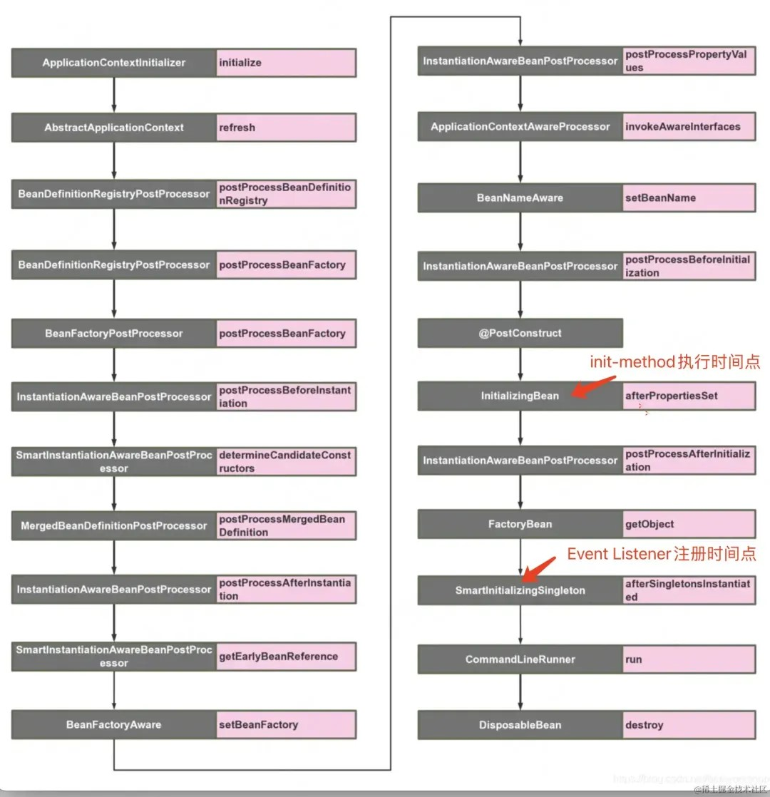
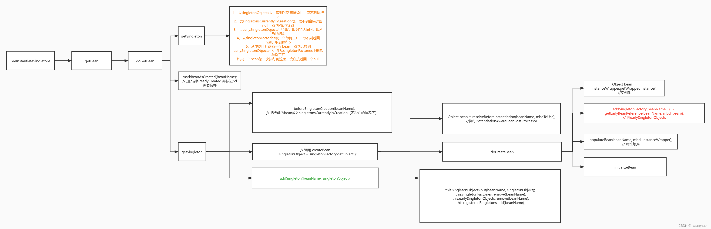

## springboot 启动流程
### 流程概述
1. SpringApplication初始化
    * 获取项目类型webApplicationType（NONE）
    * 获取bootstrapRegistryInitializers，注册bootstrapContext
    * 设置ApplicationContextInitializer
    * 设置ApplicationListener
    * 推断main方法所在类
2. SpringApplication.run()
   * **方法createBootstrapContext()** : 创建bootstrapContext。遍历每个BootstrapRegistryInitializer（cloud中的RefreshBootstrapRegistryInitializer和TextEncryptorConfigBootstrapper），执行initialize方法。
     * RefreshBootstrapRegistryInitializer添加closeListener。
     * TextEncryptorConfigBootstrapper文本加密配置初始化。
   * **方法getRunListeners()** : 从META-INF/spring.factories中获取配置的springApplicationRunListener(boot中的EventPublishingRunListener)，初始化EventPublishRunListener等，使用listeners初始化SpringApplicationRunListeners。
   * **listeners.starting()** : 启动监听器，执行SpringApplicationRunListener的staring方法。
     * refreshApplicationListeners方法，获取SpringApplication中的listeners，添加到AbstractApplicationEventMulticaster中的defaultRetriever.applicationListeners中。
     * starting方法调用multicastEvent，获取对应类型（EventType:ApplicationStartingEvent，sourceType:SpringApplication）的ApplicationListener。启动ApplicationListener（执行onApplicationEvent）。
   * 初始化ApplicationArguments
   * **prepareEnvironment()** : 获取配置环境ConfigurableEnvironment（cloud的ApplicationReactiveWebEnvironment，boot的SpringApplicationEnvironment）。
     * listeners.environmentPrepared方法，获取事件类型为ApplicationEnvironmentPreparedEvent，用于获取系统配置或配置文件配置。
     * cloud中BootstrapApplicationListener会创建SpringApplicationBuilder并执行run方法，初始化Bootstrap容器，加载bootstrap相关配置。 Bootstrap容器启动完成后，设置为当前容器的父容器，合并配置，返回bootstrap容器。
     * boot中的ConfigDataEnvironmentPostProcessor读取配置文件中的配置流程：监听器EnvironmentPostProcessorApplicationListener执行onApplicationEvent，通过成员变量postProcessorFactory获取EnvironmentPostProcessor（包括ConfigDataEnvironmentPostProcessor）,遍历EnvironmentPostProcessor并执行postProcessEnvironment方法。
   * 打印banner
   * 根据项目类型创建ApplicationContext，设置ApplicationStartup
   * **方法prepareContext()** : spring容器前置处理
     * 设置环境
     * 设置ConversionService
     * 执行ApplicationContext的initialize，添加初始化器到应用上下文
     * listeners.contextPrepared，执行事件类型（ApplicationContextInitializedEvent），LoggingApplicationListener执行onApplicationPreparedEvent，注册log相关类。
     * 获取beanFactory，注册相关单例类
     * listeners.contextLoaded，执行事件类型（ApplicationPreparedEvent）
   * 刷新容器
     * 刷新前准备prepareRefresh方法
       1. initPropertySources方法：啥也没干
       2. getEnvironment().validateRequireProperties()：获取requiredProperties的配置，实际啥也没干
       3. 将初始的ApplicationListeners设置到earlyApplicationListeners
     * 获取BeanFactory
     * 扩展BeanFactory功能，设置beanClassLoader等需要的bean
     * postProcessBeanFactory - 空方法
     * invokeBeanFactoryPostProcessors(beanFactory)：
       1. 获取BeanFactoryPostProcessors，区分BeanDefinitionRegistryPostProcessor（添加于registryProcessors中）和BeanFactoryPostProcessor（添加到regularPostProcessors中）。
       2. 获取ConfigurationClassPostProcessor，添加到registryProcessors中，并作为参数执行invokeBeanDefinitionRegistryPostProcessors方法，调用其postProcessBeanDefinitionRegistry -> postProcessBeanDefinitions[解析参考](https://www.cnblogs.com/dw3306/p/17942636)方法。
          * 获取ConfigurationClassParser并执行parse方法。
            * 进入ComponentScanAnnotationParser.parse方法，初始化ClassPathBeanDefinitionScanner，设置所需参数。
            * 执行ClassPathBeanDefinitionScanner.doScan()，扫描ComponentScan路径下所有class文件，判断哪些类需要注册为BeanDefinition，例如：注解@Componenet，@Configuration，是否跳过ConditionOn等。
            * 获取beanDefinition，处理为BeanDefinitionHolder，注册到beanFactory的beanDefinitionMap中，key为beanName，value为BeanDefinition。
            * 后续循环处理扫描到的Set<BeanDefinitonHolder>，源码注释(递归处理扫描到的类)-Check the set of scanned definitions for any further config classes and parse recursively if needed
            * processImport处理@Import注解类，3类：ImportBeanDefinitionRegistrar（AutoConfigurationPackages.Registrar）、ImportSelector（AutoConfigurationImportSelector类）、其他，记录相关配置类。
            * 检索所有@Bean方法，生成beanMethod，添加到configClass的beanMethod中。
            * 执行this.deferredImportSelectorHandler.process()处理ImportSelector（自动配置的AutoConfigurationImportSelector）
              * 一系列处理后调用AutoConfigurationImportSelector.process() -> ConfigurationClassParser.processGroupImports() -> grouping.getImports() -> AutoConfigurationImportSelector.process() -> getAutoConfigurationEntry()获取所有自动配置类。
              * getAttributes获取注解类全名，getCandidateConfigurations从META-INF/spring/org.springframework.boot.autoconfigure.AutoConfiguration.imports路径下获取所有自动配置类。
              * removeDuplicates去除重复配置类，根据onBeanCondition、onClassCondition、onWebApplicationCondition过滤配置类，输出boolean[]，false将配置类数组对应位置置空，重新构造一个配置类数组，去除不满足的配置类。
              * fireAutoConfigurationImportEvents获取监听器AutoConfigurationImportListener，广播AutoConfigurationImportEvent事件。
              * 遍历并处理获取的所有配置类，添加到ConfigurationClassParser中的configurationClasses中。
          * reader.loadBeanDefinitions(configClasses)，处理自动配置类，注册beanDefinition到beanFactory。
       3. 获取beanDefinition中的BeanDefinitionRegistryPostProcessor，并调用其postProcessBeanDefinitionRegistry，eg:MapperScannerConfigurer，扫描mapperScan配置路径下的mapper接口，注册beanDefinition到beanFactory。
       4. invokeBeanFactoryPostProcessors()：调用BeanFactoryPostProcessor的postProcessBeanFactory方法。
           * ConfigurationClassPostProcessor.postProcessBeanFactory：获取扫描到bean中的@Configuration修饰的类，使用spring cglib进行增强，替换原beanClass，作用为缓存创建的代理对象，使configuration保持单例。
       5. 获取扫描beanDefinition里面的BeanFactoryPostProcessor，调用postProcessBeanFactory方法。
          * PropertySourcesPlaceholderConfigurer：处理配置文件中的占位符${}，代码没看出干了啥，解析beanDefinition中的PropertyValues和constructorArgumentValues中的占位符。
          * DatabaseInitializationDependencyConfigurer：
          * 执行其他无序的BeanFactoryProcessor。
          * clearMetadataCache：清理元数据缓存
     * registerBeanPostProcessors()：调佣beanFactory.addBeanPostProcessor()注册
     * beanPostProcess.end - 空方法
     * 初始化Message资源 
     * 初始化事件广播器
     * onRefresh：初始化内置tomcat。[具体步骤参考](https://baijiahao.baidu.com/s?id=1713418691466074756&wfr=spider&for=pc)
     * 注册监听器，将初始化中获取的监听器添加到事件广播器中，获取beanFactory中的监听器并添加到事件监听器
     * finishBeanFactoryInitialization方法：给beanFactory设置类型转换器，数据解析器，初始化loadTimeWeaverAware，设置冻结配置。下面执行preInstantiateSingletons：开始实例化非懒加载单例类[步骤参考](https://blog.csdn.net/wh87025569/article/details/119066600) - 实例化后会执行InitializingBean接口方法和处理PostConstruct
       1. 获取所有beanDefinitionNames，遍历，获取RootBeanDefinition（合并父类beanDefinition），判断bean为非抽象、单例、非懒加载，再判断是否为FactoryBean，是的话需特殊处理，后执行getBean。
       2. getBean方法
          * 处理beanName，前面有&（factoryBean）的处理掉。
          * getSingleton(beanName)：从一二三级缓存里查询bean是否实例化。
          * 若存在，获取bean实例
          * 不存在，一系列判断，创建bean实例，主要方法：getSingleton(beanName, objectFactory)。
            * 锁一级缓存，一级缓存获取bean，没有继续
            * beforeSingletonCreation(beanName)，检查bean是否排除，并添加到singletonsCurrentlyInCreation。
            * 调用objectFactory.getObject() -> AbstractAutowireCapableBeanFactory.createBean()：
              1. 根据RootBeanDefinition和beanName获取class引用，生成新的RootBeanDefinition。
              2. 执行resolveBeforeInstantiation（bean实例化前让BeanPostProcessors能够先返回bean的代理，AOP配置类的BeforeInstantiation在这里执行，不为空直接返回bean）。
              3. doCreateBean()
                 * 生成BeanWrapper，先从factoryBeanInstanceCache中获取。没有则调用createBeanInstance()：先获取class对象，从beanDefinition中获取InstanceSupplier，存在从里面获取beanWrapper，否则根据beanDefinition中的resolvedConstructorOrFactoryMethod获取，没有再通过其他方式获取构造方法。都没有最终调用instantiateBean方法，通过beanDefinition获取class对象，使用class获取构造方法，通过构造方法实例化bean，使用实例化的bean初始化BeanWrapper，设置BeanWrapper参数返回。
                 * 后续处理，applyMergedBeanDefinitionPostProcessor方法处理属性（eg:CommonAnnotationBeanPostProcessor.postProcessorMergedBeanDefinition获取@PostConstruct、@PreDestroy、@Resource等注解并记录[参考](https://cloud.tencent.com/developer/article/2488672);AutowiredAnnotationBeanPostProcessor处理@Autowired注解[参考](https://cloud.tencent.com/developer/article/2488670)）。
                 * 将实例化对象存入三级缓存，通过getEarlyBeanReference获取对象（若需代理则返回代理对象）。
                 * populateBean填充上面获取属性值，调用PostProcessor.postProcessProperties方法（eg：CommonAnnotationBeanPostProcessor）。
                 * initializeBean执行beanPostProcessor前置处理，initializingBean接口初始化方法，后置处理。
     * 完成刷新过程，清空资源缓存，初始化生命周期处理器，调用生命处理器的onFresh，发布最后事件
   * 容器后置处理 - afterRefresh 空方法
   * 结束执行事件
   * 执行Runners - ApplicationRunner和CommandLineRunner
### 事件处理逻辑
1. 三个组件
    * ApplicationEvent：事件类
    * ApplicationListener：事件监听器，发布事件后执行onApplicationEvent
    * ApplicationEventPublisher/ApplicationEventMulticaster：事件发布者，继承接口通过publish发布事件
2. 示例
    * src/test/java/com.ruoyi.business.test.RunTest.java
### 启动时执行方法
1. ApplicationRunner和CommandLineRunner - 启动最后一步执行。
2. InitializingBean接口 - 刷新容器过程中初始化bean时若继承接口，则执行afterPropertiesSet方法。
3. @PostConstruct - 实例化时将注解方法设置为bean的init-method，实例化时通过反射调用，与上面接口处于一个方法中。
### 自动装配原理
1. refresh和自动配置大体流程 - 自动配置处理逻辑主要在ConfigurationClassParser.parse中
   
2. @Configuration解析流程 - ConfigurationClassPostProcessor处理逻辑
   
### SpringBoot启动流程图
1. SpringBoot启动流程图，详细展示初始化过程中各配置类调用顺序

### SpringBoot AOP源码
1. 配置类引入。@EnableAspectjAutoProxy中Import导入AspectJAutoProxyRegistrar。
2. AspectJAutoProxyRegistrar：引用ImportBeanDefinitionRegistrar，注册AnnotationAwareAspectJAutoProxyCreator的BeanDefinition，然后将EnableAspectJAutoProxy注解的参数值（proxyTargetClass-是否默认使用cglib动态代理，exposeProxy-是否暴露代理对象）设置到注册的BeanDefinition中。-->|
3. AbstractAutoProxyCreator.postProcessBeforeInstantiation方法：主要功能是解析切面类，获取beanName，判断当前类是否含有切面相关注解的子类（isInfrastructureClass）且 (shouldSkip)                                                                                           |<--| 
4. AspectJAwareAdvisorAutoProxyCreator.shouldSkip方法：找到Advisor，构建Advisor（BeanFactoryAspectAdvisorsBuilder.buildAspectJAdvisors）。                                                                                                      |<--|
5. BeanFactoryAspectAdvisorsBuilder.buildAspectJAdvisors方法：处理每个Aspect类，将每个切面方法封装为Advisor(实现类为InstantiationModelAwarePointcutAdvisorImpl)                                                                                  <--|
6. AbstractAutoProxyCreator.postProcessAfterInitialization方法：找到当前类相关的Advisor，创建代理类（cglib或jdk）
### SpringBoot 事务源码
1. TransactionAutoConfiguration：自动配置类。
2. @EnableTransactionManagement：开启事务管理，引入TransactionManagementConfigurationSelector。
3. TransactionManagementConfigurationSelector：注册ProxyTransactionManagementConfiguration。
4. ProxyTransactionManagementConfiguration：注入spring事务核心类BeanFactoryTransactionAttributeSourceAdvisor（beanName为internalTransactionAdvisor）和TransactionInterceptor。
5. BeanFactoryTransactionAttributeSourceAdvisor：成员变量TransactionAttributeSourcePointcut，用于Aop代理类创建时的判断，实现@Transactional注解的扫描等。
6. TransactionInterceptor：方法拦截器，对方法进行事务管理。
### SpringBoot refresh最后一步preInstantiateSingletons流程图

### Spring @Async源码
1. @EnableAsync：开启异步注解功能，引入AsyncConfigurationSelector。
2. AsyncConfigurationSelector：注册代理配置类，默认使用ProxyAsyncConfiguration。
3. ProxyAsyncConfiguration：根据注解配置值初始化AsyncAnnotationBeanPostProcessor，设置线程池等属性。
4. AsyncAnnotationBeanPostProcessor：setBeanFactory方法中初始化AsyncAnnotationAdvisor。
5. AsyncAnnotationAdvisor：含有成员变量Advise（AnnotationAsyncExecutionInterceptor）和Pointcut（AnnotationMatchingPointcut）。
6. AnnotationAsyncExecutionInterceptor：实现MethodInterceptor接口，拦截方法，使用线程包装切入方法，根据方法返回类型执行不同的线程池方法。
### Spring @RequestMapping @Controller源码
1. AbstractHandlerMethodMapping：引用InitializingBean接口，在初始化时调用afterPropertiesSet方法，执行initHandlerMethods方法，初始化HandlerMethods，遍历所有Bean，若类上有@Controller注解（旧版本还会判断是否存在@RequestMapping），遍历每个方法，有@RequestMapping或@HttpExchange构建RequestMappingInfo，与类上的@RequestMapping合并，并保存到Map中。
2. 处理上述过程拿到的methodMap，将method注册到mappingRegistry中。
3. register方法：加写锁，封装HandlerMethod，获取mapping（RequestMappingInfo）中的url，以url为key，mapping为value添加到pathLookup中，以mapping为key，封装的MappingRegistration为value，添加到registry中，释放锁。
### Spring DispatcherServlet源码
1. 初始化：HttpServletBean.init()方法。
2. doDispatch方法：拦截并处理所有请求，下面为@Controller请求处理流程。
   1. getHandler：获取执行链，RequestMappingInfoHandlerMapping中根据url获取HandlerMethod，将HandlerMethod封装为HandlerExecutionChain，过程中设置了拦截器列表。
   2. getHandlerAdapter：根据handlerMethod获取HandlerAdapter（RequestMappingHandlerAdapter）。
   3. 执行前置拦截器方法preHandle。
   4. 执行目标方法。
   5. 执行后置拦截器方法postHandle，mappingJackson2HttpMessageConverter将返回值转换为json格式。
   6. 执行拦截器afterCompletion。
### Spring Mybatis源码解析
1. @MapperScan：引入MapperScannerRegistrar配置类。
2. MapperScannerRegistrar：注册MapperScannerConfigurer的BeanDefinition，将注解设置为配置类的属性。
3. MapperScannerConfigurer：实现了BeanDefinitionRegistryPostProcessor接口，设置参数(FactoryBean设置为MapperFactoryBean)并扫描basePackage路径下的类，注册为BeanDefinition。
4. MapperFactoryBean：Mapper实例化时调用MapperFactoryBean.getObject方法，返回Mapper的代理对象，最终调用MapperMethod.execute方法。
5. MybatisMapperMethod：初始化-command（name:类名.方法名，type：SELECT、UPDATE等）和method（解析方法的returnType和参数解析器ParamNameResolver）。执行-execute方法，根据command类型查找sqlSession相应方法执行。
6. DefaultSqlSession：调用Executor（CacheExecutor和BaseExecutor）执行sql方法。