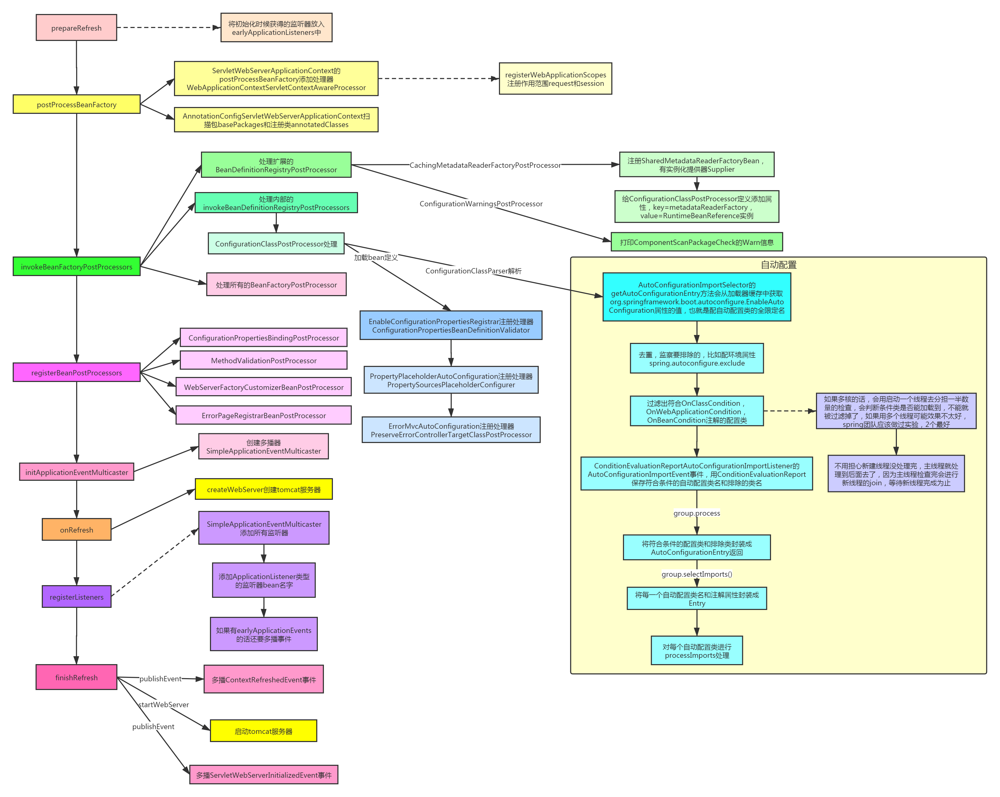
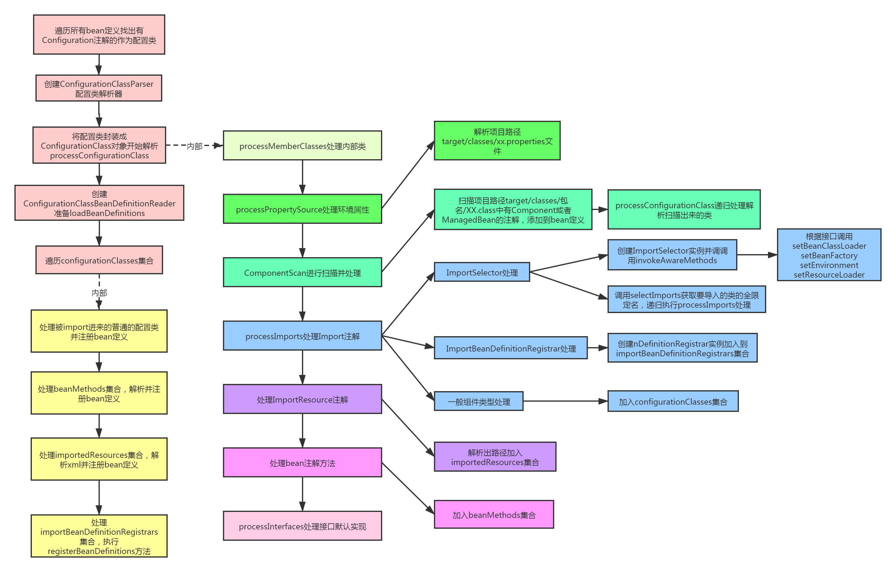

## springboot 启动流程
### 流程概述
1. SpringApplication初始化
    * 获取项目类型webApplicationType（NONE）
    * 获取bootstrapRegistryInitializers，注册bootstrapContext
    * 设置ApplicationContextInitializer
    * 设置ApplicationListener
    * 推断main方法所在类
2. SpringApplication.run()
   * **方法createBootstrapContext()** : 创建bootstrapContext。遍历每个BootstrapRegistryInitializer（cloud中的RefreshBootstrapRegistryInitializer和TextEncryptorConfigBootstrapper），执行initialize方法。
     * RefreshBootstrapRegistryInitializer添加closeListener。
     * TextEncryptorConfigBootstrapper文本加密配置初始化。
   * **方法getRunListeners()** : 从META-INF/spring.factories中获取配置的springApplicationRunListener(boot中的EventPublishingRunListener)，初始化EventPublishRunListener等，使用listeners初始化SpringApplicationRunListeners。
   * **listeners.starting()** : 启动监听器，执行SpringApplicationRunListener的staring方法。
     * refreshApplicationListeners方法，获取SpringApplication中的listeners，添加到AbstractApplicationEventMulticaster中的defaultRetriever.applicationListeners中。
     * starting方法调用multicastEvent，获取对应类型（EventType:ApplicationStartingEvent，sourceType:SpringApplication）的ApplicationListener。启动ApplicationListener（执行onApplicationEvent）。
   * 初始化ApplicationArguments
   * **prepareEnvironment()** : 获取配置环境ConfigurableEnvironment（cloud的ApplicationReactiveWebEnvironment，boot的SpringApplicationEnvironment）。
     * listeners.environmentPrepared方法，获取事件类型为ApplicationEnvironmentPreparedEvent，用于获取系统配置或配置文件配置。
     * cloud中BootstrapApplicationListener会创建SpringApplicationBuilder并执行run方法，初始化Bootstrap容器，加载bootstrap相关配置。 Bootstrap容器启动完成后，设置为当前容器的父容器，合并配置，返回bootstrap容器。
     * boot中的ConfigDataEnvironmentPostProcessor读取配置文件中的配置流程：监听器EnvironmentPostProcessorApplicationListener执行onApplicationEvent，通过成员变量postProcessorFactory获取EnvironmentPostProcessor（包括ConfigDataEnvironmentPostProcessor）,遍历EnvironmentPostProcessor并执行postProcessEnvironment方法。
   * 打印banner
   * 根据项目类型创建ApplicationContext，设置ApplicationStartup
   * **方法prepareContext()** : spring容器前置处理
     * 设置环境
     * 设置ConversionService
     * 执行ApplicationContext的initialize，添加初始化器到应用上下文
     * listeners.contextPrepared，执行事件类型（ApplicationContextInitializedEvent），LoggingApplicationListener执行onApplicationPreparedEvent，注册log相关类。
     * 获取beanFactory，注册相关单例类
     * listeners.contextLoaded，执行事件类型（ApplicationPreparedEvent）
   * 刷新容器
     * 刷新前准备prepareRefresh方法
       1. initPropertySources方法：啥也没干
       2. getEnvironment().validateRequireProperties()：获取requiredProperties的配置，实际啥也没干
       3. 将初始的ApplicationListeners设置到earlyApplicationListeners
     * 获取BeanFactory
     * 扩展BeanFactory功能，设置beanClassLoader等需要的bean
     * postProcessBeanFactory - 空方法
     * invokeBeanFactoryPostProcessors(beanFactory)：
       1. 获取BeanFactoryPostProcessors，区分BeanDefinitionRegistryPostProcessor（添加于registryProcessors中）和BeanFactoryPostProcessor（添加到regularPostProcessors中）。
       2. 获取ConfigurationClassPostProcessor，添加到registryProcessors中，并作为参数执行invokeBeanDefinitionRegistryPostProcessors方法，调用其postProcessBeanDefinitionRegistry方法。
          * 获取ConfigurationClassParser并执行parse方法。
            * 进入ComponentScanAnnotationParser.parse方法，初始化ClassPathBeanDefinitionScanner，设置所需参数。
            * 执行ClassPathBeanDefinitionScanner.doScan()，扫描ComponentScan路径下所有class文件，判断哪些类需要注册为BeanDefinition，例如：注解@Componenet，@Configuration，是否跳过ConditionOn等。
            * 获取beanDefinition，处理为BeanDefinitionHolder，注册到beanFactory的beanDefinitionMap中，key为beanName，value为BeanDefinition。
            * 后续处理扫描到的Set<BeanDefinitonHolder>，源码注释(递归处理扫描到的类)-Check the set of scanned definitions for any further config classes and parse recursively if needed
            * processImport处理@Import注解类，3类：ImportBeanDefinitionRegistrar、ImportSelector、其他，记录相关配置类。
            * 检索所有@Bean方法，生成beanMethod，添加到configClass的beanMethod中。
            * 执行this.deferredImportSelectorHandler.process()处理ImportSelector（自动配置的AutoConfigurationImportSelector）
              * 一系列处理后调用AutoConfigurationImportSelector.process() -> ConfigurationClassParser.processGroupImports() -> grouping.getImports() -> AutoConfigurationImportSelector.process() -> getAutoConfigurationEntry()获取所有自动配置类。
              * getAttributes获取注解类全名，getCandidateConfigurations从META-INF/spring/org.springframework.boot.autoconfigure.AutoConfiguration.imports路径下获取所有自动配置类。
              * removeDuplicates去除重复配置类，根据onBeanCondition、onClassCondition、onWebApplicationCondition过滤配置类，输出boolean[]，false将配置类数组对应位置置空，重新构造一个配置类数组，去除不满足的配置类。
              * fireAutoConfigurationImportEvents获取监听器AutoConfigurationImportListener，广播AutoConfigurationImportEvent事件。
              * 遍历并处理获取的所有配置类，添加到ConfigurationClassParser中的configurationClasses中。
          * reader.loadBeanDefinitions(configClasses)，处理自动配置类，注册beanDefinition到beanFactory。
       3. 获取beanDefinition中的BeanDefinitionRegistryPostProcessor，并调用其postProcessBeanDefinitionRegistry，eg:MapperScannerConfigurer，扫描mapperScan配置路径下的mapper接口，注册beanDefinition到beanFactory。
       4. invokeBeanFactoryPostProcessors()：调用BeanFactoryPostProcessor的postProcessBeanFactory方法。
           * ConfigurationClassPostProcessor.postProcessBeanFactory：获取扫描到bean中的@Configuration修饰的类，使用spring cglib进行增强，替换原beanClass，作用为缓存创建的代理对象，使configuration保持单例。
       5. 获取扫描beanDefinition里面的BeanFactoryPostProcessor，调用postProcessBeanFactory方法。
          * PropertySourcesPlaceholderConfigurer：处理配置文件中的占位符${}，代码没看出干了啥，解析beanDefinition中的PropertyValues和constructorArgumentValues中的占位符。
          * DatabaseInitializationDependencyConfigurer：
          * 执行其他无序的BeanFactoryProcessor。
          * clearMetadataCache：清理元数据缓存
     * registerBeanPostProcessors()：调佣beanFactory.addBeanPostProcessor()注册
     * beanPostProcess.end - 空方法
     * 初始化Message资源 
     * 初始化事件广播器
     * onRefresh：初始化内置tomcat。[具体步骤参考](https://baijiahao.baidu.com/s?id=1713418691466074756&wfr=spider&for=pc)
     * 注册监听器，将初始化中获取的监听器添加到事件广播器中，获取beanFactory中的监听器并添加到事件监听器
     * finishBeanFactoryInitialization方法：给beanFactory设置类型转换器，数据解析器，初始化loadTimeWeaverAware，设置冻结配置。下面执行preInstantiateSingletons：开始实例化非懒加载单例类[步骤参考](https://blog.csdn.net/wh87025569/article/details/119066600) - 实例化后会执行InitializingBean接口方法和处理PostConstruct
       1. 获取所有beanDefinitionNames，遍历，获取RootBeanDefinition（合并父类beanDefinition），判断bean为非抽象、单例、非懒加载，再判断是否为FactoryBean，是的话需特殊处理，后执行getBean。
       2. getBean方法
          * 处理beanName，前面有&（factoryBean）的处理掉。
          * getSingleton(beanName)：从一二三级缓存里查询bean是否实例化。
          * 若存在，获取bean实例
          * 不存在，一系列判断，创建bean实例，主要方法：getSingleton(beanName, objectFactory)。
            * 锁一级缓存，一级缓存获取bean，没有继续
            * beforeSingletonCreation(beanName)，检查bean是否排除，并添加到singletonsCurrentlyInCreation。
            * 调用objectFactory.getObject() -> AbstractAutowireCapableBeanFactory.createBean()：
              1. 根据RootBeanDefinition和beanName获取class引用，生成新的RootBeanDefinition。
              2. 执行resolveBeforeInstantiation（bean实例化前让BeanPostProcessors能够先返回bean的代理，不为空直接返回bean）。
              3. doCreateBean()
                 * 生成BeanWrapper，先从factoryBeanInstanceCache中获取。没有则调用createBeanInstance()：先获取class对象，从beanDefinition中获取InstanceSupplier，存在从里面获取beanWrapper，否则根据beanDefinition中的resolvedConstructorOrFactoryMethod获取，没有再通过其他方式获取构造方法。都没有最终调用instantiateBean方法，通过beanDefinition获取class对象，使用class获取构造方法，通过构造方法实例化bean，使用实例化的bean初始化BeanWrapper，设置BeanWrapper参数返回。
                 * 后续处理，applyMergedBeanDefinitionPostProcessor方法处理属性（eg:CommonAnnotationBeanPostProcessor.postProcessorMergedBeanDefinition获取@PostConstruct、@PreDestroy、@Resource等注解并记录;AutowiredAnnotationBeanPostProcessor处理@Autowired注解）。[参考](https://blog.csdn.net/qq_35512802/article/details/132165692)
                 * populateBean填充上面获取属性值，调用PostProcessor.postProcessProperties方法（eg：CommonAnnotationBeanPostProcessor）。
                 * initializeBean执行beanPostProcessor前置处理，initializingBean接口初始化方法，后置处理。
     * 完成刷新过程，清空资源缓存，初始化生命周期处理器，调用生命处理器的onFresh，发布最后事件
   * 容器后置处理 - afterRefresh 空方法
   * 结束执行事件
   * 执行Runners - ApplicationRunner和CommandLineRunner
### 事件处理逻辑
1. 三个组件
    * ApplicationEvent：事件类
    * ApplicationListener：事件监听器，发布事件后执行onApplicationEvent
    * ApplicationEventPublisher/ApplicationEventMulticaster：事件发布者，继承接口通过publish发布事件
2. 示例
    * src/test/java/com.ruoyi.business.test.RunTest.java
### 启动时执行方法
1. ApplicationRunner和CommandLineRunner - 启动最后一步执行。
2. InitializingBean接口 - 刷新容器过程中初始化bean时若继承接口，则执行afterPropertiesSet方法。
3. @PostConstruct - 实例化时将注解方法设置为bean的init-method，实例化时通过反射调用，与上面接口处于一个方法中。
### 自动装配原理
1. refresh和自动配置大体流程 - 自动配置处理逻辑主要在ConfigurationClassParser.parse中
   
2. @Configuration解析流程 - ConfigurationClassPostProcessor处理逻辑
   