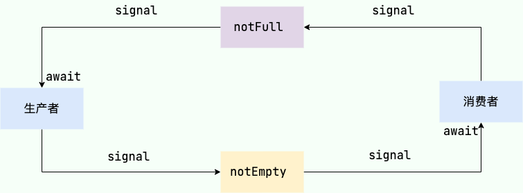

### 集合原理
1. ArrayList：底层有Object数组组成，扩容机制为需要长度大于当前数组长度进行扩容，由0扩容到1或1.5倍旧长度。
2. HashMap：底层由数组和链表组成，数组位置获取算法为(n-1) & (hash ^ hash >>> 16)，扩容系数默认0.75，当存储的数据量大于n*0.75进行扩容，扩容长度为原来1倍，保证n-1都是1，hash算法分布更分散，一个链表中的元素超过8个触发treeifyBin，若数组长度未超过64进行扩容，否则转为红黑树。
3. ConcurrentHashMap：[参考源码解析](https://javaguide.cn/java/collection/concurrent-hash-map-source-code.html#_2-concurrenthashmap-1-8)
4. ArrayBlockingQueue：含有阻塞入队和出队功能，put和take，共用同一个ReentrantLock，通过两个Condition(NotFull和NotEmpty)，入队时判断队列是否已满，若满则NotFull.await，否则元素入队并NotEmpty.signal。出队相反。

### JUC
1. 结合ReentrantLock源码分析AbstractQueuedSynchronizer(AQS)原理。
* 内部抽象类Sync继承AQS。
  * tryLock方法：获取当前线程，获取AQS的state，若state为0，则获取锁，否则判断当前线程是否已获取锁，已获取则state+1，条件都不满足则返回false。
  * tryRelease方法：c为state-releases，判断当前线程是否获取锁，否则异常，判断c==0，是释放锁，然后更新state；
  * lock方法：initialTryLock为false -> acquire(1)
  * AQS的acquire方法：[参考解析](https://blog.csdn.net/TonyAlexer/article/details/144267907)
  * NonfairSync非公平锁子类。
    * initialTryLock方法：获取当前线程，CAS赋值state，成功获取锁，否则判断当前线程是否已获取锁，已获取则state+1，条件都不满足则返回false。
    * tryAcquire方法：获取state==0且CAS赋值，成功获取锁。
* FairSync公平锁子类。
  * 方法同上，只是第一次获取锁时增加判断，只有列表的第一个线程可获取锁。
### Redis底层数据结构[参考](https://blog.csdn.net/kingandsong/article/details/141905788)
1. 动态字符串（SDS）
   * 由已保存字符串长度（len）、申请总字节数（alloc）、SDS头类型（flags）、字符数组（buf）、结束标识（\0）组成。
   * 可直接获取字符串长度。
   * 动态扩容，若字符串小于1M，新空间为扩展后字符串长度*2+1，若大于1M，新空间为扩展后字符串长度+1M+1。
   * 二进制安全，SDS按len处理字符串，不以结束标识判断，以二进制处理buf
   * 减少扩容次数
2. 整数数组（IntSet）
   * 由编码方式（encoding）、length（元素个数）、整数数组（contents）组成。
   * 编码方式支持16、32、64位整数。
   * 升级编码方式：倒叙升级
   * 二分查找
3. 字典（Dict）
   * 由dict类型（dictType *type 内置不同的hash函数）、私有数据（特殊hash运算）、哈希表（dictht ht[2]，一个是当前数据，另一个一般为空，rehash时使用）、rehash进度（-1表示未进行）、rehash是否暂停（1暂停、0继续）。
   * dictht由dictEntry数组（dictEntry **table）、哈希表小小（size）、哈希表大小掩码（size-1）、entry个数（used）组成。
   * dictEntry由键（void *key）、值（union { void *val, uint64_t u64; int64_t s64; double d; }）、下个Entry指针（dictEntry *next）组成。
   * 扩容与收缩机制：扩容因子used/size，>1且可以扩容或>5，扩容到大于used+1的第一个2^n大小。
   * rehash机制：初始化ht[1]为扩容或收缩后的哈希表，从ht[0]的table[0]开始逐个rehash到ht[1]的table中，直到都完成，复制ht[1]到ht[0]，释放旧哈希表空间。
4. 压缩链表（ZipList）
   * 由整个列表占用字节数（zlbytes）、表尾到起始地址的偏移量（zltail）、节点数量（zllen，最多65535个，多出需遍历才能知道大小）、列表节点（entry，节点长度由存储的内容决定）、末端标记（zlend，0xff）组成。
   * Entry由前一节点占用长度（1或5个字节，取决于前一节点长度是否大于254字节），编码属性（记录content数据类型），节点数据（content，整数或字符串）组成。 
5. QuickList
   * 由头节点指针（QuickListNode），尾节点指针（QuickListNode），所有zipList的节点数量（count），zipList总数量（len），zipList的Entry上限（fill，默认-3），首尾不压缩节点数量（compress），内存分配时的书签数量与数组（bookmark_count和bookmarks）。
   * QuickListNode由前节点指针（*prev），后节点指针（*next），当前节点ZipList指针（*zl），当前节点ZipList的字节大小（sz），当前节点ZipList的Entry个数（count），编码方式（encoding 1 ZipList，2 lzf压缩模式），数据容器类型（container 1 其他 2 ZipList），是否被解压缩（recompress，attempted_compress，extra）。
6. SkipList
   * 头尾节点指针（zskiplistNode），节点数量，最大索引层级。
   * zskiplistNode由节点值（ele，sds类型），节点分数（score），前一个节点指针（zskiplistNode *backword），多级索引数组（zskiplistLevel结构体）。
   * skiplistLevel有下一个节点指针（zskiplistNode *forward），索引跨度（span）。
7. redis对象（redisObject）
   * 由类型（type）、编码方式（encoding）、最后一次被访问时间（lru）、引用计数（refcount）、指向实际数据（ptr）组成。
### Redis基本数据类型[参考](https://blog.csdn.net/kingandsong/article/details/141905788)[基本命令](https://www.cnblogs.com/coder-Fish/p/17867274.html)
1. String
   * 三种编码方式：RAW，EMBSTR，INT
2. list
   * QuickList
3. set
   * 少量数据用ZipList，大量用Dict
4. zset
   * 少量用ZipList，大量用Dict+SkipList
5. hash
   * Dict
### Redisson分布式锁
1. Rlock.tryLock：通过lua脚本加锁，判断锁不存在或当前线程持有锁，hincrby创建锁或计数加1，设置过期时间。否则返回剩余时间。未获取锁成功，订阅操作；锁成功，看门狗续期。
2. unlock：获取解锁表示的锁，获取当前线程的锁，为0结束，否则-1并返回counter，counter>0，设置过期时间，解锁标识；counter=0，释放锁。