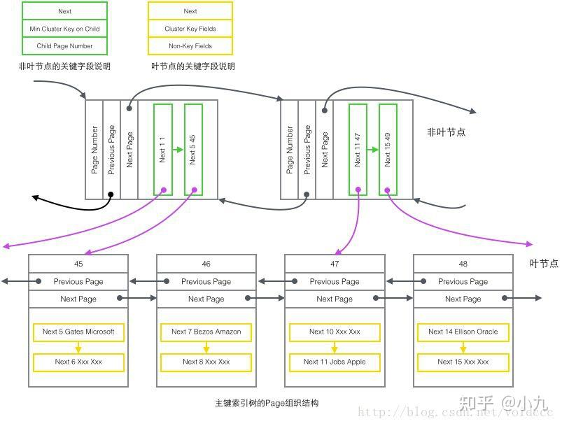
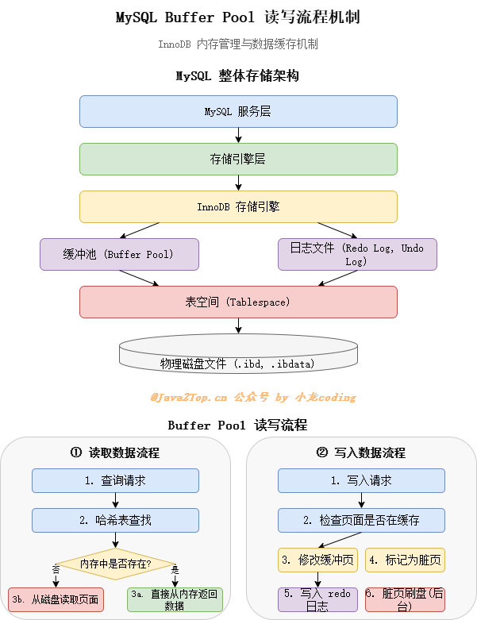
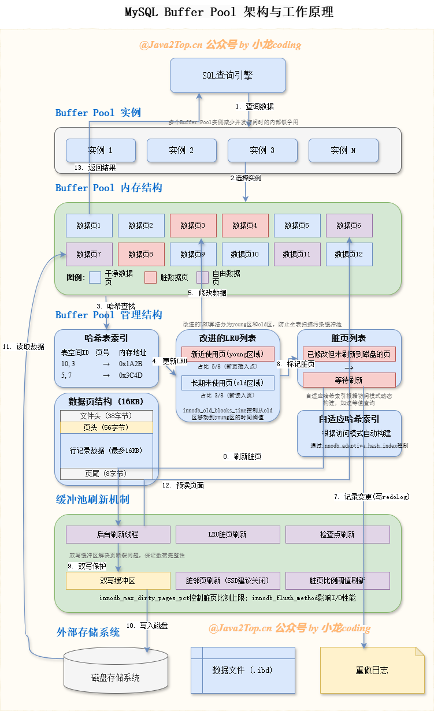
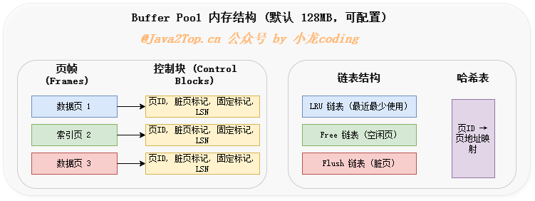
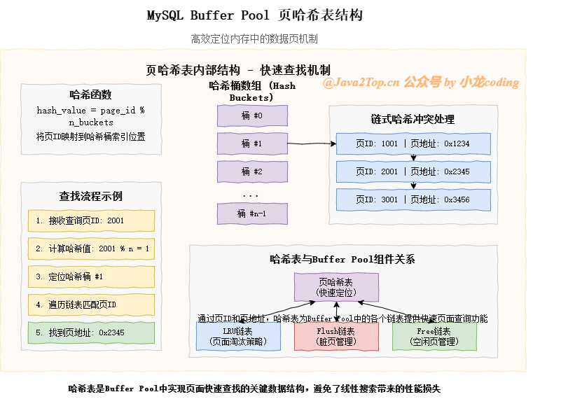
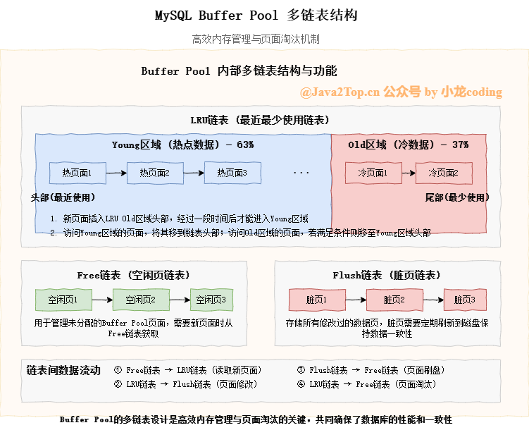
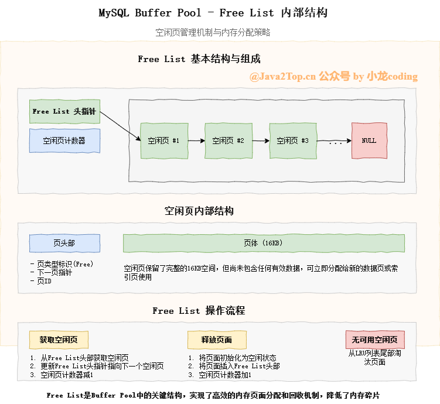
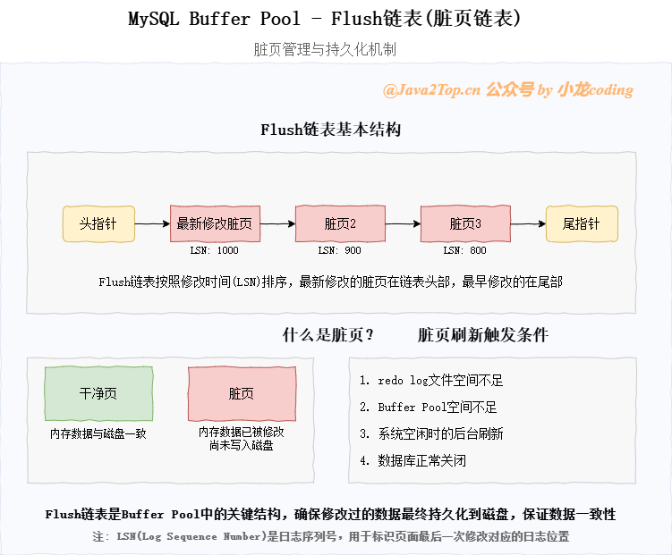
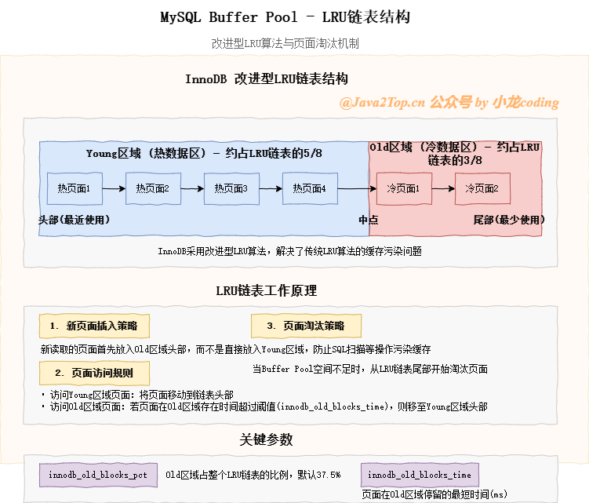
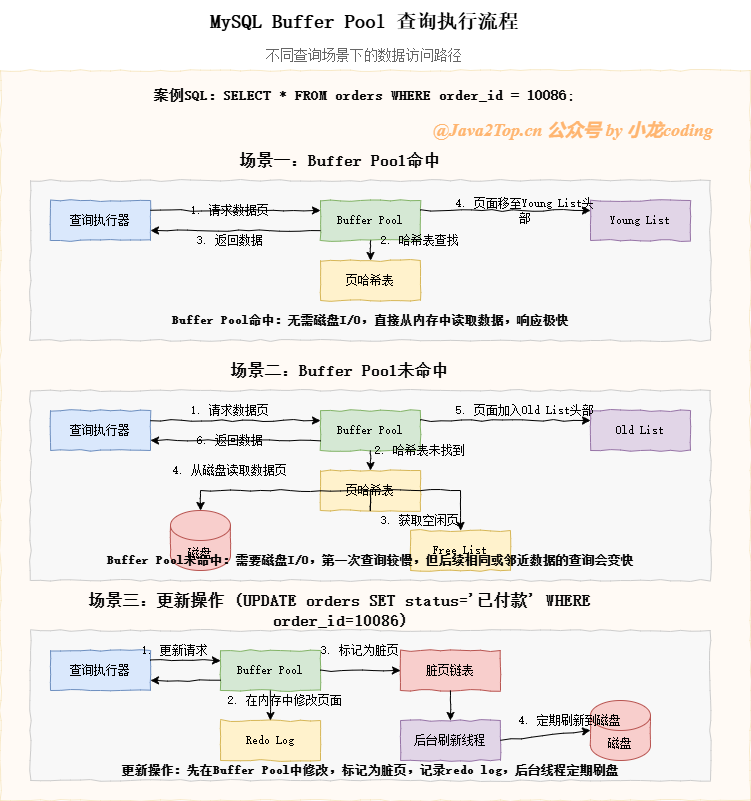

### 集合原理
1. ArrayList：底层有Object数组组成，扩容机制为需要长度大于当前数组长度进行扩容，由0扩容到1或1.5倍旧长度。
2. HashMap：底层由数组和链表组成，数组位置获取算法为(n-1) & (hash ^ hash >>> 16)，扩容系数默认0.75，当存储的数据量大于n*0.75进行扩容，扩容长度为原来1倍，保证n-1都是1，hash算法分布更分散，一个链表中的元素超过8个触发treeifyBin，若数组长度未超过64进行扩容，否则转为红黑树。
3. ConcurrentHashMap：[参考源码解析](https://javaguide.cn/java/collection/concurrent-hash-map-source-code.html#_2-concurrenthashmap-1-8)
4. ArrayBlockingQueue：含有阻塞入队和出队功能，put和take，共用同一个ReentrantLock，通过两个Condition(NotFull和NotEmpty)，入队时判断队列是否已满，若满则NotFull.await，否则元素入队并NotEmpty.signal。出队相反。

5. CopyOnWriteArrayList：add方法，加锁并通过复制数组进行添加元素；get方法直接返回，可能读到旧值；删除方法，加锁通过复制数组进行删除元素。
### JUC
1. 结合ReentrantLock源码分析AbstractQueuedSynchronizer(AQS)原理。
   * 内部抽象类Sync继承AQS。
     * tryLock方法：获取当前线程，获取AQS的state，若state为0，则获取锁，否则判断当前线程是否已获取锁，已获取则state+1，条件都不满足则返回false。
     * tryRelease方法：c为state-releases，判断当前线程是否获取锁，否则异常，判断c==0，是释放锁，然后更新state；
     * lock方法：initialTryLock为false -> acquire(1)
     * AQS的acquire方法：[参考解析](https://blog.csdn.net/TonyAlexer/article/details/144267907)
     * NonfairSync非公平锁子类。
       * initialTryLock方法：获取当前线程，CAS赋值state，成功获取锁，否则判断当前线程是否已获取锁，已获取则state+1，条件都不满足则返回false。
       * tryAcquire方法：获取state==0且CAS赋值，成功获取锁。
   * FairSync公平锁子类。
     * 方法同上，只是第一次获取锁时增加判断，只有列表的第一个线程可获取锁。
2. synchronized原理[参考](https://cloud.tencent.com/developer/article/2398496)
### Redis底层数据结构[参考](https://blog.csdn.net/kingandsong/article/details/141905788)
1. 动态字符串（SDS）
   * 由已保存字符串长度（len）、申请总字节数（alloc）、SDS头类型（flags）、字符数组（buf）、结束标识（\0）组成。
   * 可直接获取字符串长度。
   * 动态扩容，若字符串小于1M，新空间为扩展后字符串长度*2+1，若大于1M，新空间为扩展后字符串长度+1M+1。
   * 二进制安全，SDS按len处理字符串，不以结束标识判断，以二进制处理buf
   * 减少扩容次数
2. 整数数组（IntSet）
   * 由编码方式（encoding）、length（元素个数）、整数数组（contents）组成。
   * 编码方式支持16、32、64位整数。
   * 升级编码方式：倒叙升级
   * 二分查找
3. 字典（Dict）
   * 由dict类型（dictType *type 内置不同的hash函数）、私有数据（特殊hash运算）、哈希表（dictht ht[2]，一个是当前数据，另一个一般为空，rehash时使用）、rehash进度（-1表示未进行）、rehash是否暂停（1暂停、0继续）。
   * dictht由dictEntry数组（dictEntry **table）、哈希表小小（size）、哈希表大小掩码（size-1）、entry个数（used）组成。
   * dictEntry由键（void *key）、值（union { void *val, uint64_t u64; int64_t s64; double d; }）、下个Entry指针（dictEntry *next）组成。
   * 扩容与收缩机制：扩容因子used/size，>1且可以扩容或>5，扩容到大于used+1的第一个2^n大小。
   * rehash机制：初始化ht[1]为扩容或收缩后的哈希表，从ht[0]的table[0]开始逐个rehash到ht[1]的table中，直到都完成，复制ht[1]到ht[0]，释放旧哈希表空间。
4. 压缩链表（ZipList）
   * 由整个列表占用字节数（zlbytes）、表尾到起始地址的偏移量（zltail）、节点数量（zllen，最多65535个，多出需遍历才能知道大小）、列表节点（entry，节点长度由存储的内容决定）、末端标记（zlend，0xff）组成。
   * Entry由前一节点占用长度（1或5个字节，取决于前一节点长度是否大于254字节），编码属性（记录content数据类型），节点数据（content，整数或字符串）组成。 
5. QuickList
   * 由头节点指针（QuickListNode），尾节点指针（QuickListNode），所有zipList的节点数量（count），zipList总数量（len），zipList的Entry上限（fill，默认-3），首尾不压缩节点数量（compress），内存分配时的书签数量与数组（bookmark_count和bookmarks）。
   * QuickListNode由前节点指针（*prev），后节点指针（*next），当前节点ZipList指针（*zl），当前节点ZipList的字节大小（sz），当前节点ZipList的Entry个数（count），编码方式（encoding 1 ZipList，2 lzf压缩模式），数据容器类型（container 1 其他 2 ZipList），是否被解压缩（recompress，attempted_compress，extra）。
6. SkipList
   * 头尾节点指针（zskiplistNode），节点数量，最大索引层级。
   * zskiplistNode由节点值（ele，sds类型），节点分数（score），前一个节点指针（zskiplistNode *backword），多级索引数组（zskiplistLevel结构体）。
   * skiplistLevel有下一个节点指针（zskiplistNode *forward），索引跨度（span）。
7. redis对象（redisObject）
   * 由类型（type）、编码方式（encoding）、最后一次被访问时间（lru）、引用计数（refcount）、指向实际数据（ptr）组成。
### Redis基本数据类型[参考](https://blog.csdn.net/kingandsong/article/details/141905788)[基本命令](https://www.cnblogs.com/coder-Fish/p/17867274.html)
1. String
   * 三种编码方式：RAW，EMBSTR，INT
2. list
   * QuickList
3. set
   * 少量数据用ZipList，大量用Dict
4. zset
   * 少量用ZipList，大量用Dict+SkipList
5. hash
   * Dict
### Redisson分布式锁
1. Rlock.tryLock：通过lua脚本加锁，判断锁不存在或当前线程持有锁，hincrby创建锁或计数加1，设置过期时间。否则返回剩余时间。未获取锁成功，订阅操作；锁成功，看门狗续期。
2. unlock：获取解锁表示的锁，获取当前线程的锁，为0结束，否则-1并返回counter，counter>0，设置过期时间，解锁标识；counter=0，释放锁。
### Redisson红锁
1. 红锁采用主节点过半机制，即在过半的节点上操作成功。
### JDBC连接数据库
1. 加载驱动
2. 建立连接
3. 创建SQL
4. 获取执行SQL对象
5. 执行SQL
6. 返回处理结果
7. 释放资源

```java
import java.sql.PreparedStatement;
import java.sql.ResultSet;

class Test {
    public static void main(String[] args) {
        String url = "jdbc:mysql://localhost:3306/test?useUnicode=true&characterEncoding=utf-8&useSSL=false&serverTimezone=UTC";
        String username = "root";
        String password = "123456";
        String sql = "select name, age from user where id = ? and name = ?";
        // 加载驱动
        Class.forName("com.mysql.cj.jdbc.Driver");
        // 建立连接,创建执行sql对象
        try (Connection connection = DriverManager.getConnection(url, username, password);
             PreparedStatement preparedStatement = connection.prepareStatement(sql)) {
            // 设置参数
            preparedStatement.setLong(1, 1L);
            preparedStatement.setString(2, "student");
            // 执行SQL并获取返回结果
            try (ResultSet resultSet = preparedStatement.executeQuery()) {
                while (resultSet.next()) {
                    String name = resultSet.getString("name");
                    int age = resultSet.getInt("age");
                    System.out.println("name: " + name + ", age: " + age);
                }
            }
        } catch (Exception e) {
            System.err.println(e.getMessage());
        }
    }
}
```
### 项目相关
1. 项目服务：网关、认证、基础数据、工程、合同、审批、缴费发票、表具、报表。
### MYSQL相关
#### Innodb和mMyISAM区别。
   1. InnoDB支持事务和MVCC，MyISAM不支持事务；
   2. InnoDB采用行级锁，MyISAM采用表级锁；
   3. InnoDB索引分为聚集索引和二级索引，MyISAM采用非聚集索引（叶子节点存储的是数据行的物理地址）；
   4. InnoDB有主键和外键约束，主键为聚簇索引。
#### InnoDB索引结构
   1. 采用b+树数据结构。InnoDB管理的最小单位为数据页，大小默认16KB，每个B+树叶子节点对应一个或多个数据页。
   2. 假设主键为bigint，8字节，指针大小为6字节，则非叶子节点约可存储1024个主键。
   3. 假设每条数据行大小为1k字节，则每个叶子节点可存储16条数据，若为3层b+树结构，则可存储1024 * 1024 * 16条数据。
#### 页（Page）结构
   1. 页是InnoDB管理的最小单位，最基本的构件。
   2. 常见的页有数据页（B-tree Node)、Undo页、系统页、事务数据页等，默认16kB（由编译宏UNIV_PAGE_SIZE控制）,每个Page使用32位int值来唯一标识，正好对应InnoDB最大的64TB的容量（16*2^32）。
   3. Page有通用的头和尾，头部保存有前一个Page和后一个Page的指针，唯一标识Page的编号。
   4. Page的主题内容：System Records里存储这开头和结尾字符，User Records由多条Record组成。InnoDB有4种不同的Record，主键索引叶子、非叶子节点，非主键索引叶子、非叶子节点。节点通过next指针相连，组成单链表，物理顺序混乱但保持逻辑上的先后顺序。
   5. 主键索引非叶子节点存储内容：最小主键值和最小值所在Page的编号；主键叶子节点存储内容：主键和除主键外的所有列；非主键索引非叶子节点：存储辅助键里的最小值、Page编号和主键值；非主键索引叶子节点：存储辅助索引键值和主键值。
#### Buffer Pool
   1. 本质：内存缓冲区，将磁盘上的数据缓存到内存，以便快速访问。
   2. 读写流程机制
   3. 架构与工作原理
   4. BufferPool内存中分为大小相等的页，与InnoDB的数据页一致，所以即时读取一条数据，也会把整个数据页载入缓存。
   5. BufferPool内存结构
   6. 为快速查找数据页，BufferPool中维护了一个页哈希表,使得查询时间复杂度接近O(1)
   7. 生命周期管理：三大关键链表（最近最少使用链表、空闲链表、脏页链表）
      * 空闲链表（Free链表）：管理所有未使用的缓冲页。
      * 脏页链表（Flush链表）：管理脏页。
      * 最近最少使用链表（LRU链表）：缓存淘汰链表，使用改进的LRU算法，将链表分为新生代区域和老年代区域，默认分别占用5/8和3/8，新数据页先进入老年代，存在时间超过阈值则移动至头部。
   8. BufferPool工作流程。
#### 当前读和快照读
   1. 当前读有两种实现方式，一致性读和锁定读。一致性读通过创建一致性视图实现，锁定读通过加锁（共享锁或排他锁）实现（eg:for update;lock in share mode;增、删、改。）
   2. 快照读：读取一致性视图时，借助MVCC机制实现快照读。
#### 三大日志
   1. binlog：记录数据库的写入性操作。
      1. 刷盘时机：由sync_binlog参数控制。
         * 0：系统决定何时写入磁盘
         * 1：每次提交事务时写入磁盘
         * N：每提交n个事务时写入磁盘
      2. 日志格式：分为STATEMENT、ROW和MIXED
         * STATEMENT：基于SQL语句的复制。优点：不需要记录每行的变化，减少了日志量，节约IO，提高性能。缺点：某些情况会导致数据不一致（sysdate()等）
         * ROW：基于行的复制，不记录sql，仅记录哪条数据修改。优点：不会出现某些情况下存储过程、函数、触发器的调用和触发无法正确复制的问题。缺点：日志量大。
         * MIXED：基于SQL语句和行的混合复制，一般使用STATEMENT，STATEMENT无法复制时使用ROW。
   2. redo log：记录事务对数据页进行了那些修改。保持事务一致性。
      1. redo log包括两部分：内存中的日志缓存（redo log buffer），磁盘上的日志文件（redo log file）。
      2. 日志流程：每执行一条DML语句，先将记录写入redo log buffer，后续某个时间点再一次性将多个操作记录写到redo log file中。
      3. 写入时机：又innodb_flush_log_at_trx_commit参数配置，0-延迟写，每秒写入os buffer并调用fsync写入redo log file；1-实时写，实时刷，每次事务提交都会将redo log buffer中的日志写入os buffer并刷到redo log file中。2-实时写，延迟刷，每次提交都写入os buffer，每秒调用fsync刷到redo log file。
      4. 记录形式：采用大小固定，循环写入的方式。
   3. undo log：记录数据的逻辑变化。保证事务原子性。发生错误时可回滚到之前的状态。
#### MVCC机制。
   1. 隐藏字段：DB_ROW_ID：隐含的自增ID，如果数据表没有主键则以该字段生产聚簇索引。DB_TRX_ID：存储当前行数据所属的事务ID。