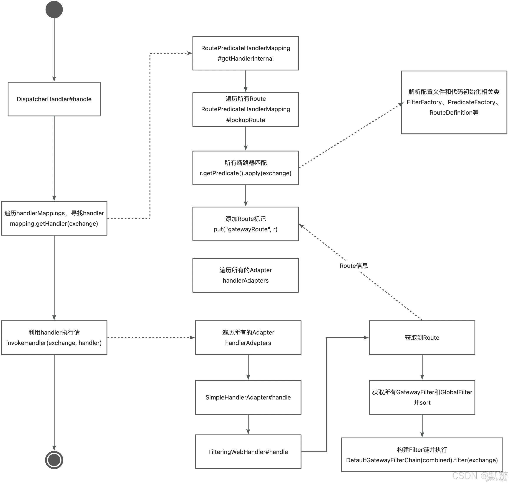

## SpringCloud 基本原理
### 网关 spring cloud gateway
1. DispatcherHandler：用于处理和分发HTTP请求。通过注册HandlerMapping和HandlerAdapter处理不同类型请求。
2. HandlerMapping：根据请求的各种信息（URI、请求类型、请求头等）返回合适的Handler。
3. HandlerAdapter：将HandlerFunction或ControllerFunction对象转为可处理HTTP请求和响应的对象。根据请求信息适配不同的Function对象。
4. HandlerFunction：处理HTTP请求并返回响应对象。
5. RouterFunction：定义HTTP请求的路由规则和对应的HandlerFunction对象。
6. ServerHttpRequest：请求对象
7. ServerHttpResponse：响应对象
8. 请求处理顺序：DispatcherHandler -> RoutePredicateHandlerMapping -> FilteringWebHandler -> DefaultGatewayFilterChain
9. 流程参考：
### 服务注册销毁
1. Registration，服务实例，服务名称、端口、ip等信息。
2. ServiceRegistry，提供服务注册（register）与注销接口（deregister）。
3. AbstractAutoServiceRegistration，实现自动注册与注销，引用ApplicationListener<WebServletInitializedEvent>，Spring启动时触发onApplicationEvent，执行注册操作。通过使用@PreDestory注解，在容器销毁时执行注销操作。
4. 定义自动配置类，分别自动实例化上面3个实例。
### 服务发现
1. 实现接口DiscoveryClient，getInstances(serviceId)获取对应id的服务实例，getServices()获取注册的所有服务名称。
### 集成ribbon

